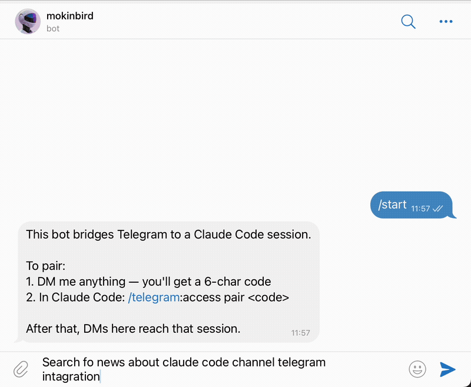
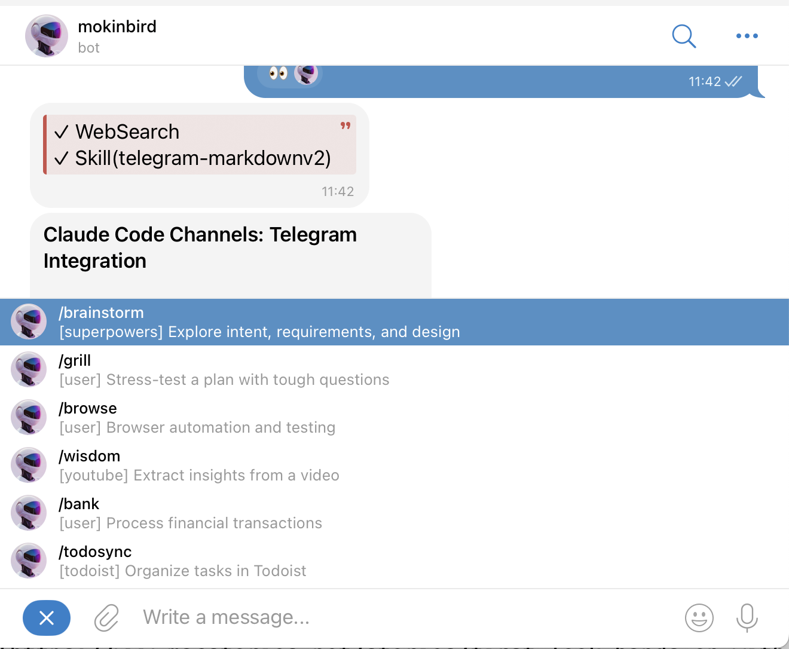

# claude-telegram-companion

Drop-in companion for the official Telegram plugin. Adds live progress tracking, persistent typing, error forwarding, command menus, MarkdownV2 formatting, and voice transcription.




| Without | With |
| --- | --- |
| Typing vanishes after 5 seconds | Typing persists for up to 5 minutes |
| No visibility into multi-step work | Live step-by-step progress in chat |
| Tool errors lost in terminal | Errors forwarded to Telegram |
| No `/` command menu | Skills auto-synced to BotFather |
| Voice messages ignored | Voice transcribed locally via whisper.cpp |

## Quick start

Requires the official `telegram` plugin to be enabled.

```
/plugin marketplace add Mokson/claude-telegram-companion
/plugin install claude-telegram-companion@claude-telegram-companion
```

Restart Claude Code. Everything works out of the box.

## What it does

The plugin runs entirely through hooks. No MCP server, no background processes at rest.

**On session start**, it injects behavioral instructions (call `react` first, use MarkdownV2, handle voice messages) and syncs your installed skills to the Telegram `/` command menu using per-chat scope so the official plugin can't overwrite them.

**On every tool call**, it tracks progress. When Claude reacts to an incoming message, the hook establishes context. On the first real tool call, it sends a progress message and spawns a typing daemon. Each subsequent tool completion updates the message with a live checklist. When Claude replies, the progress message is deleted.

**On tool failure**, if no reply has been sent yet, the error is forwarded directly to Telegram so the user isn't left waiting in silence.

## Voice transcription

Transcribes voice and audio messages locally using whisper.cpp. Optional.

```bash
brew install whisper-cpp ffmpeg
mkdir -p ~/.local/share/whisper.cpp/models
curl -L -o ~/.local/share/whisper.cpp/models/ggml-base.en.bin \
  https://huggingface.co/ggerganov/whisper.cpp/resolve/main/ggml-base.en.bin
```

Without these tools installed, Claude asks the sender to type instead.

## Configuration

Everything works without configuration. Optionally create `~/.claude/channels/telegram/command-config.json` to customize the command menu (see `config/command-config.example.json` for the schema):

| Key | Default | Purpose |
| --- | --- | --- |
| `progress.statusUpdates` | `true` | Show live progress during work |
| `commands.exclude.plugins` | `[]` | Hide entire plugins from the menu |
| `commands.exclude.skills` | `[]` | Hide individual skills |
| `commands.aliases` | `{}` | Map skills to custom `/command` names |
| `commands.extra` | `[]` | Add static commands not tied to a skill |

## License

MIT
