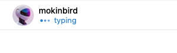
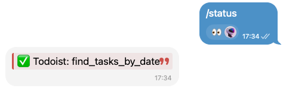

# awesome-claude-telegram

Companion plugin that upgrades Claude Code's Telegram channel with rich formatting, live progress, and voice transcription.





| Without | With |
| --- | --- |
| Plain text replies | HTML: bold, code, links, blockquotes |
| Typing vanishes after 5s | Typing persists for up to 5 minutes |
| Silent multi-step tasks | Live step-by-step progress in chat |
| Errors lost in terminal | Errors auto-forwarded to Telegram |
| No command menu | Skills synced to `/` menu |
| Voice messages ignored | Voice transcribed via whisper.cpp |

## Install

```
/plugin marketplace add Mokson/awesome-claude-telegram
/plugin install awesome-claude-telegram@awesome-claude-telegram
```

Restart Claude Code, then run `/awesome-claude-telegram:setup`.

**Requires:** Official `telegram` plugin enabled, [Bun](https://bun.sh).

## How It Works

This plugin sits alongside the official Telegram plugin. Same bot token, same access control, no conflicts.

The official plugin handles polling and message delivery. This plugin enhances everything on the output side through three hooks and a companion MCP server:

**PostToolUse hook** drives the core experience. It watches for `react` calls to establish Telegram context, auto-sends a progress message on the first tool call, spawns a background typing daemon, and cleans up when Claude replies. If a tool fails before any reply is sent, the error goes straight to Telegram.

**PreToolUse hook** feeds the daemon each tool's label so progress updates show what's happening right now.

**SessionStart hook** discovers your installed skills and syncs them to BotFather's `/` command menu.

**MCP server** provides `send` and `edit` tools with HTML formatting, auto-chunking, and parse-error fallback.

## Voice Transcription

Voice and audio messages are transcribed automatically via a built-in skill using `whisper-cli` and `ffmpeg`. No config needed. Install the tools and a model:

```bash
brew install whisper-cpp ffmpeg
mkdir -p ~/.local/share/whisper.cpp/models
curl -L -o ~/.local/share/whisper.cpp/models/ggml-base.en.bin \
  https://huggingface.co/ggerganov/whisper.cpp/resolve/main/ggml-base.en.bin
```

Without these, voice messages arrive as-is and Claude asks the user to type instead.

## Configuration

All settings live in `~/.claude/channels/telegram/command-config.json`:

| Key | Default | Purpose |
| --- | --- | --- |
| `progress.statusUpdates` | `true` | Live step-by-step progress during work |
| `commands.exclude.plugins` | `[]` | Hide entire plugins from `/` menu |
| `commands.exclude.skills` | `[]` | Hide individual skills |
| `commands.aliases` | `{}` | Map skills to custom `/command` names |
| `commands.extra` | `[]` | Add static commands not tied to any skill |

## License

MIT
