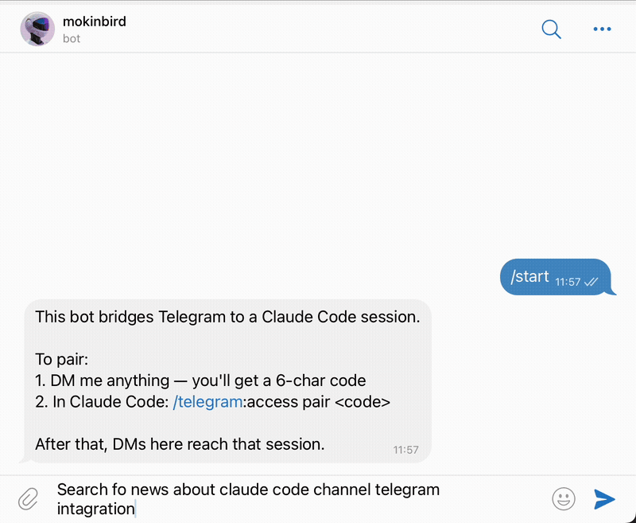

# claude-telegram-companion

Standalone Telegram channel for [Claude Code](https://claude.com/code). Self-hosted MCP server with built-in access control, live progress tracking, and reliability hardening.



## Features

- Self-hosted MCP server (no dependency on `telegram@claude-plugins-official`)
- Pairing-based access control with allowlists, group, and channel policies
- Atomic poll lock with follower mode for multi-session setups
- Persistent inbound queue with replay on restart
- Rich messages via `format: "markdown"` (Bot API 10.1+, 32K): headers, lists, compact tables, `<details>`, expandable quotes via `>!`, spoilers, custom emoji; MarkdownV2 fallback with automatic escaping
- Files embedded in the reply's rich message (photos/videos as a collage, documents and audio as media blocks); separate messages on the fallback path
- Inbound formatting preserved: user spoilers, quotes, code, and links are reconstructed from Telegram entities before reaching Claude
- Inline keyboards (Bot API 9.4 styles / custom emoji) that stay visible, disabled, with the answer marked ✓ after a tap; reply-to context, forum supergroup topics, channel posts
- Live progress UX: persistent tool-call tracker edited in place (quiet blockquote, silent send) that collapses into an expandable summary when the turn ends; optional draft streaming with a native thinking block; per-chat command menus; typing keepalive
- `⏹ Stop` button on the progress message (and native Stop on drafts) interrupts the running Claude turn — requires the session to run in tmux

## Install

```bash
/plugin marketplace add Mokson/claude-telegram-companion
/plugin install claude-telegram-companion@claude-telegram-companion
```

Disable the official plugin if previously enabled:

```bash
/config
# set telegram@claude-plugins-official to disabled
```

## Setup

Create a bot via [@BotFather](https://t.me/BotFather) and store its token:

```bash
mkdir -p ~/.claude/channels/telegram
echo 'TELEGRAM_BOT_TOKEN=123456:AAH...' > ~/.claude/channels/telegram/.env
chmod 600 ~/.claude/channels/telegram/.env
```

Pair your Telegram account:

1. DM the bot — you receive a 6-character code.
2. In Claude Code, run `/claude-telegram-companion:access pair <code>`.
3. Send a message. Claude replies.

## Configuration

State lives in `~/.claude/channels/telegram/access.json`. Manage via the `access` skill:

| Command | Purpose |
| --- | --- |
| `/claude-telegram-companion:access pair <code>` | Approve a pending pairing |
| `/claude-telegram-companion:access allow <user-id>` | Add a user to the allowlist |
| `/claude-telegram-companion:access group add <chat-id>` | Enable a group |
| `/claude-telegram-companion:access set ackReaction 👀` | Set ack reaction emoji |

Optional environment variables:

| Variable | Purpose |
| --- | --- |
| `TELEGRAM_STATE_DIR` | Override the state dir (default `$CLAUDE_CONFIG_DIR/channels/telegram/`, else `~/.claude/channels/telegram/`) |
| `TELEGRAM_PLUGIN_HEARTBEAT` | Path to write a unix-timestamp heartbeat for external watchdogs |
| `TELEGRAM_ACCESS_MODE=static` | Snapshot access at boot (no runtime mutation) |

## License

Apache-2.0. The MCP server is forked from [anthropics/claude-plugins-official](https://github.com/anthropics/claude-plugins-official) under Apache-2.0; companion skills, hooks, and scripts inherit the same license for consistency.
